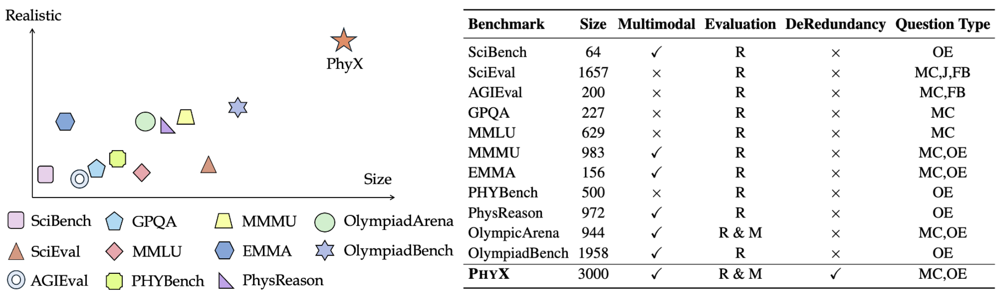
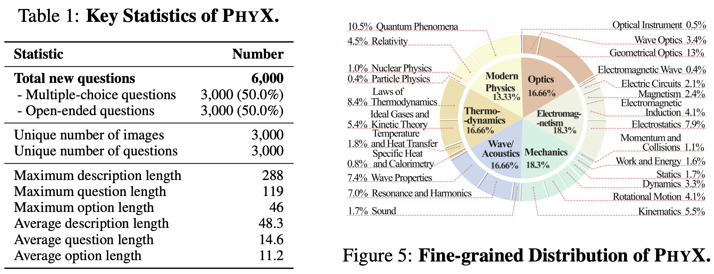

# PhyX: Are Your Models Adequate for Physical World Reasoning?

PhyX is the first large-scale benchmark specifically designed to assess models' ability in physical reasoning through realistic, visually grounded scenarios.

PhyX includes 3,000 meticulously collected multimodal questions, covering 7 reasoning types across 25 sub-domains and 6 core domains: thermodynamics, electromagnetism, mechanics, modern physics, optics, and wave acoustics.

## Data



PhyX specializes in university-level challenging questions presented through realistic, high-fidelity visual scenarios. Unlike general-purpose benchmarks, our tasks require models to integrate visual cues with implicit physical laws, going beyond simple knowledge recall and demanding nuanced, context-driven inference. This design enables a rigorous evaluation of true multimodal reasoning about the physical world, exposing key limitations in current models’ capabilities when handling professional-level scientific problems.



PhyX consists of 3,000 visually grounded physics questions, carefully curated across six distinct physics domains:
- Mechanics (550)
- Electromagnetism (550)
- Thermodynamics (500)
- Wave/Acoustics (500)
- Optics (500)
- Modern Physics (400)

Data examples:


## Evaluation

The evaluation code is implemented based on [VLMEvalKit](https://github.com/open-compass/VLMEvalKit ), and we thank the authors for their efforts.

Please follow the [official readme](README_vlmeval.md) to create a pip/conda environment.

In this repository, we provide both Multiple-Choice and Open-ended versions of the data in the `LMUData` folder. For additional formats, please visit the [Google Drive link](https://drive.google.com/file/d/1g6amKMcNSEwg5rfQPsryGtcFiaNGkNaH/view?usp=sharing ) to download and extract the files.

We use DeepSeek-V3 as the LLM-based judger. Please set the `SiliconFlow_API_KEY` to use it, or alternatively, you can perform rule-based judgment.

To evaluate a VLM on PhyX, simply run `run.sh`:


```
cd VLMEvalKit

export OPENAI_API_KEY=
export LMUData="./LMUData"
export SiliconFlow_API_KEY=


# valid_type: STR, LLM
python -u run.py --data PhyX_mini_IMG \
    --model GPT4o_20241120 \
    --judge deepseek --judge-args '{"valid_type": "LLM"}'

```

This example shows how to evaluate `GPT4o_20241120` using DeepSeek-V3 as the judge.

### Details for these parameters:

- `--data`: The dataset configuration to evaluate, e.g., `PhyX_mini_MC_IMG` for multiple-choice or `PhyX_mini_IMG` for open-ended.
- `--model`: The model to be evaluated. Please refer to [this link](https://aicarrier.feishu.cn/wiki/Qp7wwSzQ9iK1Y6kNUJVcr6zTnPe?table=tblsdEpLieDoCxtb ) for supported models.
- `--valid_type`: Judgment method — `LLM` for LLM-based evaluation or `STR` for rule-based matching.

After running the evaluation, results will be saved in the `outputs` folder.


